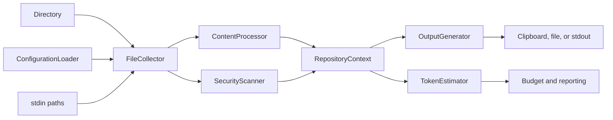

# Architecture

PromptPack separates repository discovery, content shaping, and output generation into a small local pipeline.

The source-project boundaries and contributor rules are documented in the
[development architecture guide](./development-architecture.md). This page
focuses on what happens when an end user runs PromptPack.

## Collection phase

`FileCollector` walks the selected directory and converts paths to repository-relative paths. It starts with common build-directory exclusions, adds patterns from `.gitignore` and `.ignore`, then applies custom `--include` and `--exclude` patterns. The older `--ignore` name remains supported. `--no-gitignore` and `--no-default-patterns` disable those sources independently.

`ConfigurationLoader` merges global and repository configuration files before collection. `StdinPathReader` reads newline-delimited paths in the CLI and asks `FileCollector` to filter them. `FileCollector` can also return a separate full tree for `--full-tree` (`--include-full-directory-structure` remains supported as an alias).

An include pattern must match before a file can enter the pipeline. An ignore match removes it afterward. Patterns are comma-separated and use the CLI's glob matching rules.

## Processing phase

`ContentProcessor` reads each selected file and creates a `ProcessedFile` containing:

- Absolute and relative paths
- Processed content
- Content size
- A language label inferred from the extension

Processing is ordered and opt-in: comment removal, empty-line removal, and compression can be combined.

Compression is intentionally structural rather than semantic. It keeps declarations and statement-shaped lines while replacing implementation blocks with `{ ... }`. Review compact output before relying on it for detailed behavior.

## Context and generation

`RepositoryContext` holds the processed files and controls whether generated output includes:

- File summary metadata
- Directory structure
- File contents
- Line numbers
- Custom header and instructions
- A separate full directory structure
- Security findings from the optional scanner

`SecurityScanner` is built into the .NET application and uses conservative local pattern matching for common private keys, AWS access keys, GitHub tokens, and generic secret assignments. It runs by default and requires no external runtime. The optional Secretlint adapter invokes `npx @secretlint/quick-start` when Node.js/npm is available. Findings are reported for review and do not remove matching files from the package.

Four generators implement the same context contract:

| Style      | Best for                      | Shape                                                   |
| ---------- | ----------------------------- | ------------------------------------------------------- |
| `xml`      | Structured model input        | `<repository>` with metadata, structure, and file CDATA |
| `markdown` | Human review and chat prompts | Headings, tree, and fenced file contents                |
| `json`     | Programmatic consumers        | Metadata and files keyed by relative path               |
| `plain`    | Simple text pipelines         | Delimited sections without markup                       |

## Token estimates

`TokenEstimator` reports a heuristic estimate based on words and code-like tokens. It is useful for comparing outputs and enforcing a limit, but it is not a tokenizer for a specific model.

With `--token-budget`, PromptPack sets exit code `2` when the generated output exceeds the requested estimate. With `--token-count`, it prints the total and the ten largest per-file estimates.

When `--split-output` is supplied with a file destination, the generated text is divided into numbered sibling files using the requested byte, KB, or MB size.

## Data boundaries

PromptPack is a local packaging tool. It does not upload repository contents or retrieve live external context. Clipboard behavior depends on the host environment and is handled by the CLI's `ClipboardService`, which uses the `TextCopy` package.
