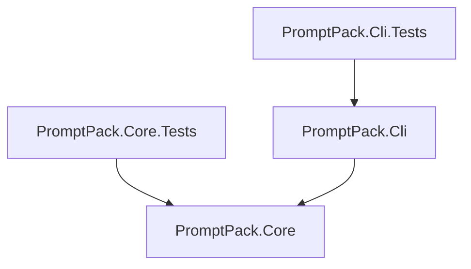

# Development Architecture

This page is for contributors working on PromptPack itself. End users should start with the [quickstart](./quickstart.md), [workflow guide](./workflow.md), or [CLI reference](../reference/cli.md).

## Project structure

PromptPack intentionally uses two production projects:

```text
PromptPack/
├── src/
│   ├── PromptPack.Core/
│   │   ├── Collection/
│   │   ├── Configuration/
│   │   ├── Interfaces/
│   │   ├── Models/
│   │   ├── Output/
│   │   ├── Processing/
│   │   └── Security/
│   └── PromptPack.Cli/
│       ├── Commands/
│       ├── Extensions/
│       ├── Input/
│       ├── Platform/
│       └── Program.cs
└── tests/
    ├── PromptPack.Core.Tests/
    └── PromptPack.Cli.Tests/
```

### `PromptPack.Core`

Core contains packing behavior that can run without Spectre.Console, terminal
input, or clipboard access:

- `Collection` discovers files and applies include, exclude, and `.gitignore` rules.
- `Configuration` loads and merges JSON/YAML settings.
- `Models` contains configuration and pipeline data structures.
- `Processing` transforms content and estimates tokens.
- `Security` scans selected content for common secret patterns.
- `Output` renders one repository context as Markdown, XML, JSON, or plain text.
- `Interfaces` defines the contracts used by the CLI and tests.

Core must not reference the CLI. It must not depend on Spectre.Console, TextCopy,
or `Console.In`.

### `PromptPack.Cli`

The CLI is the composition and interaction layer:

- `Program.cs` configures dependency injection, logging, and Spectre.Console.Cli.
- `Commands` parses options and coordinates a packing operation.
- `Input` reads newline-delimited paths from standard input.
- `Platform` handles clipboard access through `TextCopy`.
- `Extensions` contains CLI integration helpers.

The CLI owns terminal progress, stdout redirection, file destinations, clipboard
copying, exit codes, and user-facing errors. Core returns data and does not decide
where generated output is sent.

### Tests

`PromptPack.Core.Tests` covers collection, configuration, processing, security, and
output behavior without constructing the CLI. `PromptPack.Cli.Tests` covers command
parsing and terminal/platform integration.

## Dependency direction



There is no `Hosting`, `ServiceDefaults`, `Storage`, `Protocol`, or `SDK` project.
PromptPack is a local CLI with no service host, database, or independent public
protocol. Add another project only when it has a separate consumer or lifecycle.

## Change guidelines

- Add repository behavior to Core, not to a Spectre command.
- Keep terminal, clipboard, stdin, and exit-code behavior in CLI.
- Add Core tests beside Core changes and CLI tests beside command changes.
- Preserve the Core-to-CLI dependency direction.
- Update the user-facing guides when a command or output behavior changes.
